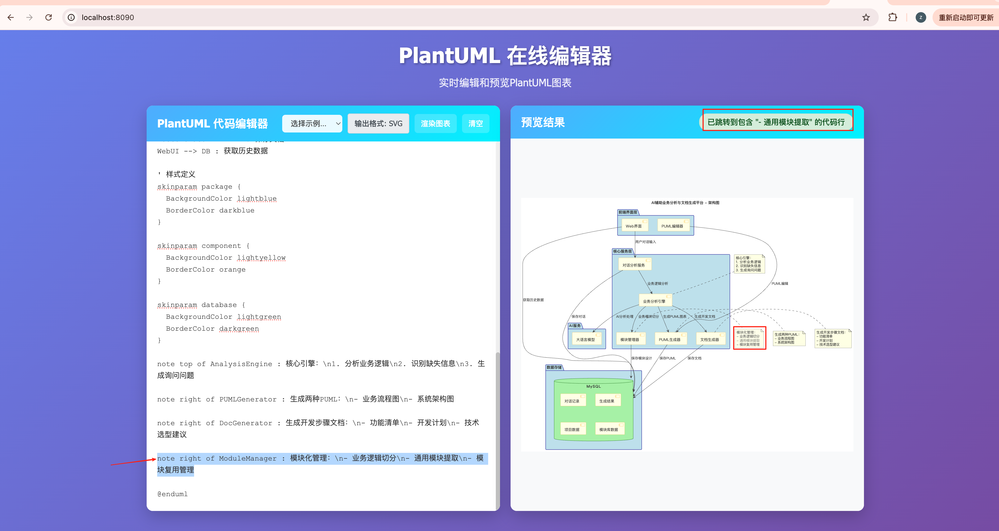

# 🚀 PlantUML 在线编辑器

这是一个基于 Go 语言和原生 JavaScript 构建的轻量级在线 PlantUML 编辑器。它提供了一个简洁的 Web 界面，可以实时将 PlantUML 代码渲染成可交互的 SVG 图表，并支持点击图表元素跳转到对应的代码行。


---

## 📸 项目截图



## ✨ 主要功能

- **实时SVG渲染**: 在浏览器中实时编写 PlantUML 代码并预览 SVG 结果。
- **代码双向同步**: 点击渲染出的 SVG 图表中的元素（如参与者、类、用例），编辑器将自动跳转并高亮显示对应的代码行。
- **纯粹的Web体验**: 后端使用 Go 标准库 `net/http` 构建，前端使用原生 JavaScript，无任何重型框架。
- **内置示例**: 提供多种常用图表（序列图、用例图、类图、活动图）的示例代码，方便快速上手。
- **简洁响应式界面**: 干净、直观的双栏布局，代码编辑器在左，预览在右。
- **键盘快捷键**: 使用 `Ctrl+Enter` (或 `Cmd+Enter`) 快速渲染图表。
- **本地部署**: 所有服务均在本地运行，确保代码和图表的私密性。

---

## 🛠️ 技术栈

- **后端**: Go 1.21+ (`net/http`)
- **前端**: HTML5, CSS3, Vanilla JavaScript (ES6+)
- **核心依赖**: [PlantUML Server](https://github.com/plantuml/plantuml-server) (通过 Docker 运行)

---

## 🏁 快速开始

请按照以下步骤在本地运行此项目。

### 1. 先决条件

确保你的系统已安装以下软件：
- [Go](https://go.dev/doc/install) (版本 >= 1.21)
- [Docker](https://www.docker.com/products/docker-desktop/)

### 2. 启动 PlantUML 服务

首先，我们需要在后台启动一个 PlantUML 服务器容器。该服务将负责将 PlantUML 代码转换为 SVG。

打开终端并运行以下命令：

```bash
docker run -d --name plantuml-server -p 8888:8080 plantuml/plantuml-server:jetty
```

- `-d`: 在后台运行容器。
- `--name plantuml-server`: 为容器指定一个名称。
- `-p 8888:8080`: 将你本机的 8888 端口映射到容器的 8080 端口。我们的 Go 应用将通过 `http://localhost:8888` 与之通信。

你可以通过运行 `docker ps` 来确认容器是否正在运行。

### 3. 启动 Web 应用

接下来，启动我们的 Go Web 服务器。

在项目根目录下，运行以下命令：

```bash
go run main.go
```

启动成功后，你将看到以下输出：

```
2025/07/10 20:49:22 PlantUML在线编辑器启动在端口 :8090
2025/07/10 20:49:22 PlantUML服务地址: http://localhost:8888
```

### 4. 访问编辑器

现在，打开你的浏览器并访问：

**[http://localhost:8090](http://localhost:8090)**

---

## 📖 使用指南

1.  **编写代码**: 在左侧的文本区域输入或粘贴你的 PlantUML 代码。
2.  **加载示例**: 从顶部的下拉菜单中选择一个示例来快速体验不同类型的图表。
3.  **渲染图表**: 点击 "渲染图表" 按钮或使用快捷键 `Ctrl+Enter` / `Cmd+Enter`。
4.  **查看结果**: 渲染后的 SVG 图表将显示在右侧的预览区域。
5.  **交互跳转**:
    - 将鼠标悬停在 SVG 图表的元素上，你会看到一个悬浮效果。
    - 点击任意元素（例如，一个参与者或一个类），左侧编辑器的光标将自动跳转到定义该元素的代码行。

---

## 📂 项目结构

```
.
├── main.go                    # Go 后端主程序，包含Web服务和HTML模板
├── go.mod                     # Go 模块依赖文件
├── static/
│   ├── app.js                 # 前端核心业务逻辑
│   ├── svg-click-handler.js   # 处理SVG点击交互的模块
│   └── styles.css             # 界面样式
├── API_Documentation.md       # 详细的后端API接口文档
├── README.md                  # 项目说明文件 (本文件)
└── ...                        # 其他文档和配置文件
```

---

## 📄 API 文档

本项目提供了一套简单的 RESTful API 用于前后端通信。详细的接口定义、请求/响应格式和示例，请参阅 [API_Documentation.md](./API_Documentation.md)。

---

## 💡 贡献

欢迎提交问题 (Issues) 或拉取请求 (Pull Requests) 来改进这个项目！

---

## 📜 许可证

本项目采用 [MIT 许可证](./LICENSE)。
