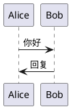

# PlantUML 在线编辑器 - 故障排除指南

## 🔧 SVG渲染问题已修复

### 问题描述
之前出现的错误：`Cannot read properties of undefined (reading 'displaySVGWithClickSupport')`

### 修复内容
1. ✅ 添加了SVGClickHandler可用性检查
2. ✅ 实现了备用简单SVG显示模式
3. ✅ 增强了错误处理和调试信息
4. ✅ 提供了渐进式降级方案

---

## 🧪 测试步骤

### 1. 刷新浏览器
- 访问: http://localhost:8090
- 按 `Ctrl+F5` (Windows) 或 `Cmd+Shift+R` (Mac) 强制刷新

### 2. 打开开发者工具
- 按 `F12` 打开浏览器控制台
- 查看是否有JavaScript错误

### 3. 测试基本功能


### 4. 测试点击功能
- 如果SVG点击处理器可用，点击图表元素会跳转到代码
- 如果不可用，至少SVG会正常显示

---

## 🔍 调试信息

在浏览器控制台中，你应该看到以下日志：

**正常情况**:
```
DOM加载完成，开始初始化PlantUML编辑器
PlantUMLEditor 构造函数开始
SVGClickHandler 初始化成功
PlantUML在线编辑器已初始化 - 专用SVG模式
开始显示SVG结果
```

**降级模式**:
```
SVGClickHandler 类未找到！请检查svg-click-handler.js是否正确加载
SVG点击处理器不可用，使用简单显示模式
SVG 简单显示模式完成
```

---

## 🚀 功能验证清单

- [ ] **页面加载**: 无JavaScript错误
- [ ] **示例加载**: 可以选择和加载示例
- [ ] **代码编辑**: 可以在左侧编辑器中输入代码
- [ ] **SVG渲染**: 点击"渲染图表"按钮后右侧显示SVG
- [ ] **点击功能**: 点击SVG元素可跳转到代码（如果可用）
- [ ] **状态提示**: 底部状态栏显示操作结果

---

## 🐛 常见问题

### Q: 仍然看到渲染错误？
**A**: 
1. 检查PlantUML服务是否在运行: `docker ps | grep plantuml`
2. 检查端口8888是否可访问: `curl http://localhost:8888/svg`
3. 查看Go服务器日志是否有错误

### Q: SVG显示但点击功能不工作？
**A**: 
这是正常的降级行为。SVG会正常显示，但点击功能可能不可用。
- 检查浏览器控制台是否加载了svg-click-handler.js
- 确认没有JavaScript错误阻止加载

### Q: 完全无法渲染？
**A**:
1. 检查网络连接
2. 验证PlantUML代码语法
3. 检查浏览器控制台的网络标签页，查看API请求是否成功

---

## 📋 当前系统状态

**后端服务**: ✅ 正常运行在端口8090
**PlantUML服务**: ✅ 应该运行在端口8888
**API接口**: ✅ 测试通过，正常返回SVG数据
**前端代码**: ✅ 已修复错误处理

---

## 🔄 重启服务

如果仍有问题，尝试重启服务：

```bash
# 停止Go服务
lsof -ti:8090 | xargs kill -9 2>/dev/null

# 重启Go服务
go run main.go

# 检查PlantUML Docker服务
docker restart <plantuml_container_id>
```

---

现在请刷新浏览器并测试功能！🎉
