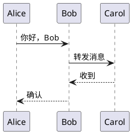

# PlantUML 在线编辑器 - 点击跳转功能使用说明

## 新功能：点击图表元素跳转到代码

### 使用方法

1. **启动服务器**
   ```bash
   go run main.go
   ```
   
2. **打开浏览器**
   访问 http://localhost:8090

3. **输入PlantUML代码**
   在左侧编辑器中输入PlantUML代码

4. **选择SVG格式**
   在输出类型下拉框中选择"SVG"（点击功能仅在SVG格式下可用）

5. **渲染图表**
   点击"渲染图表"按钮

6. **点击图表元素**
   在右侧预览区域，鼠标悬停在图表元素上会有高亮效果
   点击任意图表元素（如参与者、类、用例等），编辑器会自动跳转到对应的代码行

### 支持的图表类型

- **序列图**: 点击参与者名称跳转到对应代码
- **用例图**: 点击用例或角色跳转到对应代码
- **类图**: 点击类名跳转到对应代码
- **其他图表**: 点击文本元素跳转到包含该文本的代码行

### 测试示例



### 使用提示

1. 确保使用SVG输出格式才能使用点击功能
2. 点击图表中的文字或图形元素
3. 编辑器会自动高亮并滚动到对应的代码行
4. 状态栏会显示跳转结果

### 技术特性

- 支持多种PlantUML图表类型
- 智能元素名称匹配
- 自动代码行高亮和滚动
- 错误处理和用户反馈

享受更便捷的PlantUML编辑体验！
